# Justice Law Office

> A modern, multilingual law office website providing professional legal services with seamless Arabic/English support and optimized performance.


---

## Features

- **Multilingual Support** - Seamless switching between 5 languages (Arabic, English, French, German, Italian)
- **RTL/LTR Layouts** - Full support for right-to-left and left-to-right languages
- **Smooth Animations** - Centralized animation system powered by Framer Motion
- **Fully Responsive** - Optimized for all devices and screen sizes
- **Type-Safe** - Built with TypeScript for robust development
- **SEO Optimized** - Comprehensive meta tags and structured data
- **Lightning Fast** - Powered by Vite with optimized performance (90+ Lighthouse score)

---

## Tech Stack

<div align="center">


</div>

| Technology | Purpose |
|------------|---------|
| React 19 | Modern UI library with latest features |
| TypeScript | Type-safe development |
| Tailwind CSS 4 | Utility-first styling framework |
| Framer Motion 11 | Smooth animations and transitions |
| Zustand 5 | Lightweight state management |
| i18next & react-i18next | Internationalization system |
| React Icons 5 | Icon library |
| Country Flag Icons 1 | Flag components for language selector |
| Vite 6 | Fast build tool and dev server |

---

## Live Demo

**Production:** [https://justice-azure.vercel.app/](https://justice-azure.vercel.app/)

**Repository:** [https://github.com/MohamedFadl2344/justice.git](https://github.com/MohamedFadl2344/justice.git)

---

## Project Architecture

```mermaid
graph TD
    A[src/] --> B[components/]
    A --> C[hooks/]
    A --> D[i18n/]
    A --> E[locales/]
    A --> F[pages/]
    
    B --> B1[common/]
    B --> B2[features/]
    B --> B3[layout/]
    
    B2 --> F1[hero/]
    B2 --> F2[about/]
    B2 --> F3[services/]
    B2 --> F4[statistics/]
    B2 --> F5[testimonials/]
    B2 --> F6[contact/]
    
    B3 --> L1[navbar/]
    B3 --> L2[footer/]
    
    C --> H1[useAnimations]
    C --> H2[useCarousel]
    C --> H3[useMobileMenu]
    
    D --> I1[index.ts]
    D --> I2[languageStore.ts]
    D --> I3[languages.ts]
    
    E --> E1[ar/]
    E --> E2[en/]
    E --> E3[fr/]
    E --> E4[de/]
    E --> E5[it/]
    
    F --> P1[Home.tsx]
    
    style A fill:#1a3a52
    style B fill:#2a4a62
    style C fill:#2a4a62
    style D fill:#2a4a62
    style E fill:#2a4a62
    style F fill:#2a4a62
```



### Why This Structure?

**Feature-Based Organization**
- Each feature (Hero, Services, Testimonials, etc.) is self-contained with its own components
- Easy to locate and maintain related code
- Scalable architecture for adding new features

**Centralized Animation System**
- Custom `useAnimations` hook provides all animation variants
- Consistent motion design across the entire website
- Better performance with reusable variants
- Easy to modify animations from a single location

**Internationalization**
- Separate translation files for each feature and layout
- Namespace-based organization prevents key conflicts
- Zustand-powered language store with localStorage persistence
- Automatic translation loading on app initialization

**Type Safety**
- TypeScript throughout the entire project
- Type-safe translation hooks
- Better IDE support with autocomplete and error detection

---

## Getting Started

### Installation

```bash
# Clone repository
git clone https://github.com/MohamedFadl2344/justice.git

# Navigate to project directory
cd justice

# Install dependencies
npm install
```

### Development

```bash
# Start development server
npm run dev
```

### Production

```bash
# Build for production
npm run build

# Preview production build
npm run preview
```

---

## Key Sections

| Section | Description |
|---------|-------------|
| **Hero** | Eye-catching introduction with call-to-action buttons |
| **About** | Law office mission, values, and commitment to clients |
| **Services** | Comprehensive legal services (Civil, Criminal, Commercial, Family Law) |
| **Statistics** | Key achievements and success metrics |
| **Testimonials** | Client reviews and success stories |
| **Contact** | Contact form, office information, and Google Maps integration |

---

## Performance Optimizations

### Implemented Optimizations

| Optimization | Impact | Status |
|--------------|--------|--------|
| Centralized Animations | Better performance, easier maintenance | ✅ Done |
| Font Preloading | ~330ms faster load time | ✅ Done |
| Image Optimization | Reduced image sizes with proper dimensions | ✅ Done |
| Code Splitting | Lazy loading for Testimonials & Contact | ✅ Done |
| WebP Images | Already optimized | ✅ Done |

### Performance Metrics

**Desktop**
- Performance: 94
- Accessibility: 98
- Best Practices: 100
- SEO: 100

**Mobile**
- Performance: 85
- Accessibility: 98
- Best Practices: 100
- SEO: 100

---

## Design Philosophy

**Color Scheme**
- Primary: Deep Navy (#1a3a52) - Professional and trustworthy
- Secondary: Elegant Gold (#d4a574) - Premium and sophisticated
- Accent: Soft Gray - Clean and modern

**Typography**
- Cairo font family for Arabic text
- Tajawal for additional Arabic support
- Modern sans-serif for English content
- Responsive font sizes for all devices

**Animations**
- Centralized animation system using `useAnimations` hook
- Smooth entrance effects with Framer Motion
- Optimized performance with viewport detection
- Consistent transitions across all components

---

## Internationalization

### Supported Languages

| Language | Code | Direction | Status |
|----------|------|-----------|--------|
| Arabic | ar | RTL | ✅ Default |
| English | en | LTR | ✅ Complete |
| French | fr | LTR | ✅ Complete |
| German | de | LTR | ✅ Complete |
| Italian | it | LTR | ✅ Complete |

### Translation Structure

```
locales/
├── ar/
│   ├── features/
│   │   ├── hero.json
│   │   ├── about.json
│   │   ├── services.json
│   │   ├── statistics.json
│   │   ├── testimonials.json
│   │   └── contact.json
│   └── layout/
│       ├── navbar.json
│       └── footer.json
├── en/
├── fr/
├── de/
└── it/
```

---

## SEO Features

- **Meta Tags**: Comprehensive title, description, and keywords
- **Open Graph**: Social media sharing optimization
- **Twitter Cards**: Enhanced Twitter previews
- **Structured Data**: JSON-LD for legal services
- **Geo Tags**: Cairo, Egypt location information
- **Canonical URLs**: Proper URL canonicalization
- **Author Attribution**: Mohamed Fadl

---

## Browser Support

- Chrome (latest)
- Firefox (latest)
- Safari (latest)
- Edge (latest)
- Mobile browsers (iOS Safari, Chrome Mobile)

---

## Author

**Mohamed Fadl**

---

## License

All rights reserved.

---

*Built with React and TypeScript for professional legal services*
